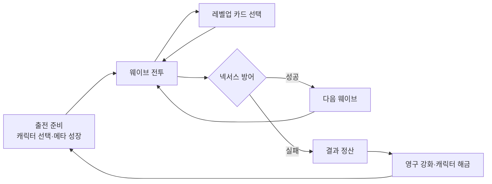

### 중앙 기지를 지키며 성장하는 웨이브 디펜스 · 로그라이크

몬스터를 처치해 몸을 확장하고 무기를 조합하며,  
끊임없이 몰려오는 적으로부터 **넥서스(Nexus)**를 방어하는 PC 게임입니다.

 

  

  
  

[게임 빌드 다운로드](https://drive.google.com/file/d/1VkQZIn8_dw6294x1DyaUQprYBBwBn_6I/view?usp=sharing)
[기술 포트폴리오](docs/WormNight_Technical_Portfolio.pptx)

---

## 📌 프로젝트 개요

| 항목         | 내용                                       |
| ---------- | ---------------------------------------- |
| **게임명**    | 웜나이트 (WormNight)                         |
| **플랫폼**    | Windows PC                               |
| **개발 엔진**  | Unity `6000.3.15f1 LTS`                  |
| **개발 언어**  | C#                                       |
| **장르**     | 웨이브 디펜스 · 로그라이크                          |
| **핵심 플레이** | 몬스터 처치 → 카드 선택 성장 → 넥서스 방어               |
| **개발 방식**  | 팀 프로젝트                                   |
| **담당 업무**  | UI 시스템 · 성장 시스템 · 데이터 저장 · 패턴 설계 · 기능 구현 |

---

## 🎮 게임 소개

플레이어는 지렁이 형태의 캐릭터를 조작해 몰려오는 몬스터를 처치하고, 중앙의 **넥서스**를 방어합니다.  
경험치를 모아 레벨업하면 **3장의 카드 중 하나를 선택**하여 새로운 무기를 획득하거나 기존 능력을 강화할 수 있습니다.

한 번의 플레이가 끝나도 획득한 재화와 강화 정보는 유지됩니다.  
반복 플레이를 통해 캐릭터를 영구 강화하고 새로운 캐릭터를 해금하며 더 높은 웨이브에 도전합니다.

  

  
**▲ 이미지를 클릭하면 전체 게임 플레이 영상으로 이동합니다.**

---

## ✨ 핵심 플레이

### 🃏 1. 카드 선택 성장

레벨업 시 제시되는 3장의 카드 중 하나를 선택하여 성장 방향을 결정합니다.  
초반에는 새로운 무기를 확보하고, 후반에는 보유 무기를 강화하는 방식으로 빌드를 완성합니다.

  

### ⚔️ 2. 웨이브 디펜스

웨이브마다 수와 종류가 달라지는 적을 처치하며 중앙 넥서스를 보호합니다.  
캐릭터의 몸에 장착된 여러 무기가 동시에 공격하여 후반부에는 대규모 전투가 펼쳐집니다.

  

### 🤖 3. 자동 플레이와 2배속

자동 이동 · 자동 전투 · 자동 카드 선택을 하나의 기능으로 통합했습니다.  
반복 구간은 자동으로 진행하고, 이동 입력이 감지되면 즉시 수동 조작으로 전환됩니다.

---

## 🧩 주요 구현 기능

| 기능               | 구현 내용                                                       |
| ---------------- | ----------------------------------------------------------- |
| **레벨업 카드 선택**    | ScriptableObject 기반 카드 데이터 · 레벨 구간별 카드 구성 · 이벤트 기반 UI 실행    |
| **스킬 SFX · VFX** | 스킬 사용 가능 여부와 강화 결과를 시각·청각 효과로 전달                            |
| **UI 애니메이션**     | DOTween 기반 카드·버튼 등장/퇴장 연출 · Unscaled Time 적용                |
| **보스 체력 UI**     | 현재 체력과 최근 피해량 분리 표시 · 흔들림과 잔상 피드백                           |
| **오디오 관리**       | Singleton · DontDestroyOnLoad · 상황별 BGM · CrossFade · 볼륨 저장 |
| **데이터 저장**       | Newtonsoft.Json 기반 재화·성장 데이터 저장 및 복원                        |
| **자동 플레이**       | 자동 이동·전투·카드 선택 통합 · 2배속 · 수동 조작 즉시 전환                       |

---

## 🏗️ 핵심 설계

### 이벤트 기반 기능 연결 — Observer Pattern

- 경험치가 최대치에 도달하면 레벨업 이벤트만 전달
- 카드 UI · 능력치 · 체력 · 경험치 UI를 독립된 스크립트로 분리
- 직접 참조를 줄여 기능 추가 및 수정 시 다른 시스템에 미치는 영향 최소화

### 기존 코드 변경 없이 기능 확장 — Sidecar Pattern

- 기존 스킬 및 능력치 코드를 유지한 채 별도 컴포넌트로 기능 추가
- UI 연출과 강화 기능을 독립적으로 분리
- 팀 작업 중 Git 병합 충돌 가능성 감소

### 안정성 강화

- `Unscaled Time`을 사용해 일시정지 중에도 UI 애니메이션 유지
- `DOKill()`을 활용해 애니메이션 중복 실행 방지
- 데이터 로드 중 자동 저장을 중지해 저장·불러오기 충돌 방지

---

## 🔄 게임 진행 흐름

> **전투로 성장하고, 넥서스를 방어하며, 실패해도 더 강해져 다시 도전하는 순환 구조입니다.**

---

## 🖼️ 플레이 화면

|                   |              |
| ----------------- | ------------ |
| **캐릭터 · 맵 선택**    | **보너스 스테이지** |
| **후반 웨이브 대규모 전투** |              |

---

## 🛠️ 기술 스택

| 분류                  | 사용 기술                                            |
| ------------------- | ------------------------------------------------ |
| **Engine**          | Unity `6000.3.15f1 LTS`                          |
| **Language**        | C#                                               |
| **UI Animation**    | DOTween                                          |
| **Data**            | ScriptableObject · PlayerPrefs · Newtonsoft.Json |
| **Architecture**    | Observer Pattern · Sidecar Pattern · Singleton   |
| **Version Control** | Git · GitHub                                     |

---

## 👤 담당 개발

**안건준** — UI 시스템 · 성장 시스템 · 데이터 저장 · 패턴 설계 및 기능 구현

프로젝트에서는 단순 기능 구현뿐만 아니라 **유지보수성 · 확장성 · 안정성**을 함께 고려했습니다.  
기존 코드를 최대한 보존하면서 기능을 확장하고, 실제 플레이 중 발생할 수 있는 중복 실행과 데이터 충돌을 방지하는 구조를 구현했습니다.

  

