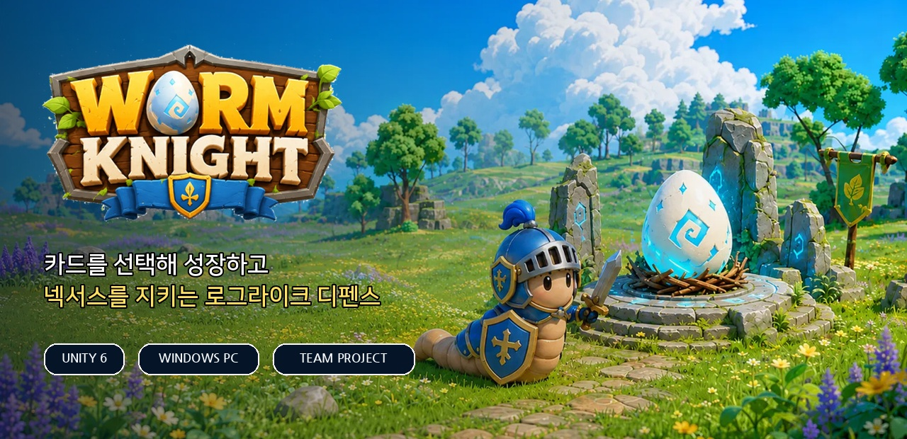
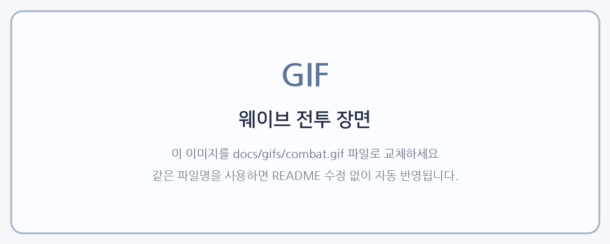
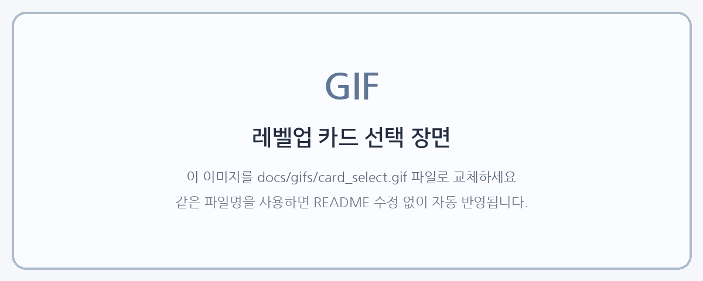
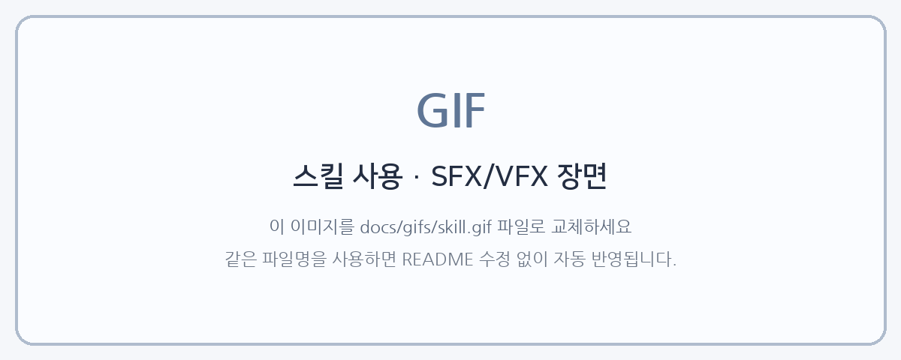
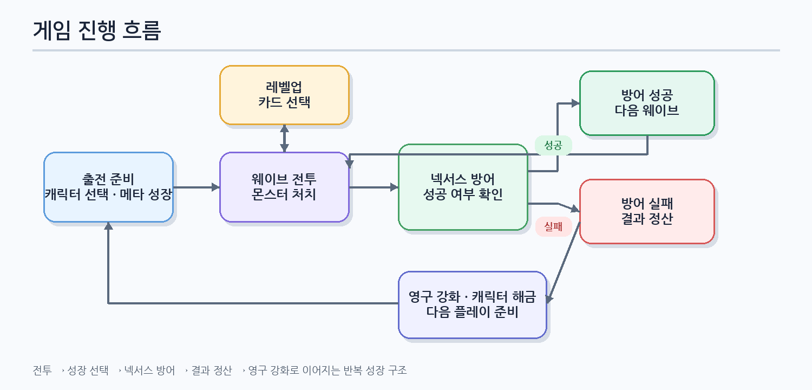

 

**몸을 확장하고 무기를 조합하며, 중앙의 넥서스를 끝까지 지켜내는 웨이브 디펜스 게임**

 

---

## 📌 프로젝트 개요

| 항목 | 내용 |
|---|---|
| **게임명** | 웜나이트 (WormNight) |
| **플랫폼** | Windows PC |
| **개발 엔진** | Unity `6000.3.15f1 LTS` |
| **장르** | 웨이브 디펜스 · 로그라이크 |
| **핵심 플레이** | 몬스터 처치 → 카드 선택 성장 → 넥서스 방어 |
| **개발 방식** | 팀 프로젝트 |
| **담당 업무** | UI 시스템 · 성장 시스템 · 데이터 저장 · 패턴 설계 · 기능 구현 |

---

## 🎮 게임 소개

플레이어는 지렁이 형태의 캐릭터를 조작해 몰려오는 몬스터를 처치하고, 중앙의 **넥서스(Nexus)**를 방어합니다.  
전투 중 경험치를 모아 레벨업하면 **3장의 카드 중 하나를 선택**해 새로운 무기를 획득하거나 기존 능력을 강화합니다.

플레이가 종료된 뒤에도 획득한 재화와 성장 정보는 유지됩니다.  
캐릭터를 영구 강화하고 새로운 캐릭터를 해금하며 더 높은 웨이브에 반복 도전할 수 있습니다.

## ✨ 핵심 플레이

### ⚔️ 1. 웨이브 전투

시간이 지날수록 강해지는 몬스터 웨이브를 상대하며 중앙 넥서스를 보호합니다.  
몸에 장착된 여러 무기가 동시에 공격하고, 성장한 빌드에 따라 전투 방식이 달라집니다.

### 🃏 2. 카드 선택 성장

레벨업 시 3장의 카드 중 하나를 선택해 성장 방향을 결정합니다.  
초반에는 새로운 무기를 확보하고, 후반에는 기존 무기와 능력치를 강화하며 빌드를 완성합니다.

### ✨ 3. 스킬 SFX · VFX

스킬 사용 가능 여부와 강화 결과를 효과음과 시각 효과로 전달합니다.  
전투 중에도 별도 설명 없이 스킬 상태를 빠르게 확인할 수 있도록 구성했습니다.

### 🤖 4. 자동 플레이 · 2배속

자동 이동·전투·카드 선택을 하나의 기능으로 통합했습니다.  
반복 구간은 자동으로 진행하고, 이동 입력이 들어오면 즉시 수동 조작으로 전환됩니다.

---

## 🔄 게임 진행 흐름

> **전투에서 성장하고 넥서스를 방어하며, 실패하더라도 영구 강화로 이어져 다시 도전하는 순환 구조입니다.**

---

## 🧩 주요 구현 기능

| 기능 | 구현 내용 |
|---|---|
| **레벨업 카드 선택** | ScriptableObject 기반 카드 데이터 · 레벨 구간별 카드 구성 · 이벤트 기반 UI 실행 |
| **스킬 SFX · VFX** | 스킬 사용 가능 여부와 강화 결과를 시각·청각 효과로 전달 |
| **UI 애니메이션** | DOTween 기반 카드·버튼 등장/퇴장 연출 · Unscaled Time 적용 |
| **보스 체력 UI** | 현재 체력과 최근 피해량 분리 표시 · 흔들림과 잔상 피드백 |
| **오디오 관리** | Singleton · DontDestroyOnLoad · 상황별 BGM · CrossFade · 볼륨 저장 |
| **데이터 저장** | Newtonsoft.Json 기반 재화·성장 데이터 저장 및 복원 |
| **자동 플레이** | 자동 이동·전투·카드 선택 통합 · 2배속 · 수동 조작 즉시 전환 |

---

## 🏗️ 핵심 설계

### 이벤트 기반 기능 연결 — Observer Pattern

- 경험치 최대 도달 시 레벨업 이벤트 전달
- 카드 UI·능력치·체력·경험치 UI를 독립된 스크립트로 분리
- 직접 참조를 줄여 기능 수정과 확장에 따른 영향 최소화

### 기존 코드 변경 없이 기능 확장 — Sidecar Pattern

- 기존 스킬·능력치 코드를 유지한 채 별도 컴포넌트로 기능 추가
- UI 연출과 강화 기능을 독립적으로 분리
- 팀 작업 중 코드 충돌과 수정 범위 최소화

### 안정성 강화

- `Unscaled Time`으로 일시정지 중에도 UI 애니메이션 유지
- `DOKill()`을 활용한 애니메이션 중복 실행 방지
- 데이터 로드 중 자동 저장을 중지해 저장·불러오기 충돌 방지

---

## 🛠️ 기술 구성

| 분류 | 사용 기술 |
|---|---|
| **Engine** | Unity `6000.3.15f1 LTS` |
| **UI Animation** | DOTween |
| **Data** | ScriptableObject · PlayerPrefs · Newtonsoft.Json |
| **Architecture** | Observer Pattern · Sidecar Pattern · Singleton |
| **Version Control** | Git · GitHub |

---

## 👤 담당 개발

**안건준** — UI 시스템 · 성장 시스템 · 데이터 저장 · 패턴 설계 · 기능 구현

기능을 단순히 추가하는 데 그치지 않고, **기존 시스템에 미치는 영향을 줄이는 구조와 실제 플레이 중 발생할 수 있는 예외 상황**까지 고려했습니다.  
기능별 역할을 분리하고 중복 실행과 데이터 충돌을 방지해, 수정과 확장이 쉬운 형태로 구현했습니다.
